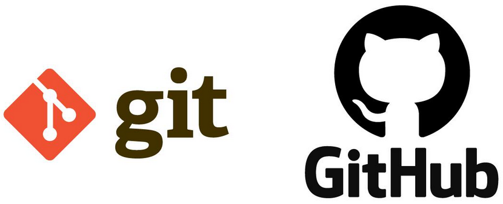
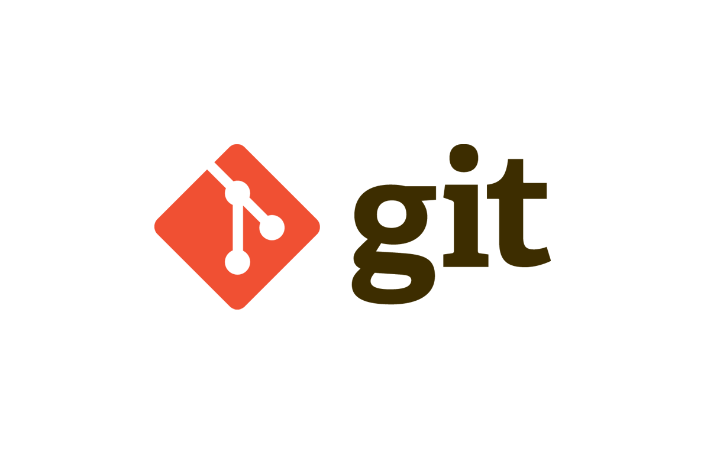
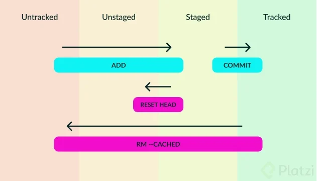
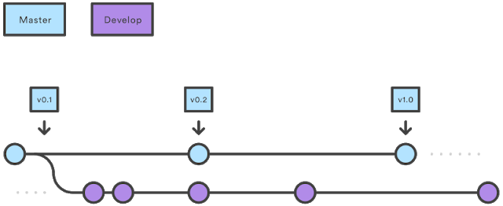
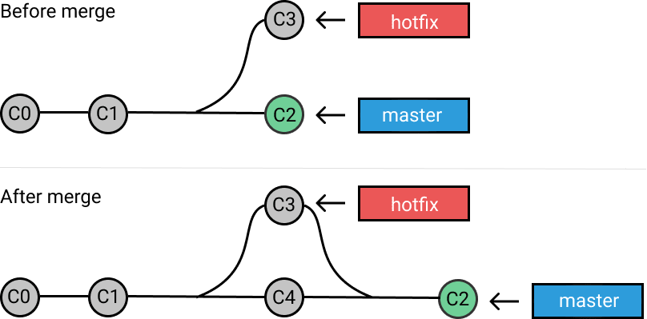

<div align="center">
  <h1>Curso profesional de Git y GitHub</h1>
</div>

<div align="center"> 
  
</div>

# Introducción al documento

El contenido de este documento son apuntes del [Curso profesional de Git y GitHub](https://platzi.com/clases/git-github/) y busca ser una guía. El mismo está dictado por [Freddy Vega](https://github.com/freddier) CEO y fundador de [Platzi](https://platzi.com).
***

## Tabla de contenido

- [Introducción a Git](#Introducción-a-Git)
    - [¿Qué es Git y GitHub?](#¿Qué-es-Git-y-GitHub?)
    - [¿Porque usar un sistema de control de versiones como Git?](#¿Porque-usar-un-sistema-de-control-de-versiones-como-Git?)
      - [Comandos iniciales en Git](#Comandos-iniciales-en-Git)
    - [Instalando](#Instalando)
    - [Editores de código, archivos binarios y de texto plano](#Editores-de-código,-archivos-binarios-y-de-texto-plano)
    - [Introducción a la terminal y línea de comando](#Introdución-a-la-terminal-y-línea-de-comando)
      - [Comandos básicos en la terminal](#Comandos-básicos-en-la-terminal)

- [Comandos básicos de Git](#Comandos-básicos-de-Git)
  - [¿Qué es el staging y los repositorios? Ciclo básico de trabajo en Git](#¿Qué-es-el-staging-y-los-repositorios?-Ciclo-básico-de-trabajo-en-Git)
    - [Ciclo de vida o estados de los archivos en Git](#Ciclo-de-vida-o-estados-de-los-archivos-en-Git)
    - [Ramas o branch's y cómo funciona un Merge en Git](#Ramas-o-branch's-y-cómo-funciona-un-Merge-en-Git)
    - [Analizar cambios en los archivos de tu proyecto con Git](#Analizar-cambios-en-los-archivos-de-tu-proyecto-con-Git)
- [Flujo de trabajo básico en Git](#Flujo-de-trabajo-básico-en-Git)
- [Trabajando con repositorios remotos en GitHub](#Trabajando-con-repositorios-remotos-en-GitHub)
- [Flujos de trabajo profesionales](#Flujos-de-trabajo-profesionales)
- [Multiples entornos de trabajo](#Multiples-entornos-de-trabajo)
- [Comandos en Git para casos de emergencia](#Comandos-en-Git-para-casos-de-emergencia)
- [Bonus](#Bonus)


## Introducción a Git

### ¿Qué es Git y GitHub?
[Git](https://git-scm.com/) es un software de control de versiones diseñado por [Linus Torvalds](https://es.wikipedia.org/wiki/Linus_Torvalds), pensando en la eficiencia y la confiabilidad del mantenimiento de versiones de aplicaciones cuando estas tienen un gran número de archivos de código fuente. 

En el siguiente enlace se encuentra el [libro oficial de Git](https://git-scm.com/book/es/v2)

<div align="center"> 
  
  <p></p>
</div>

En su lugar [GitHub](https://github.com/) es una forja para alojar proyectos utilizando el sistema de control de versiones Git. GitHub sería la red social de código para los programadores, tu propio curriculum vitae.

<div align="center"> 
  
  <p></p>
</div>

### ¿Porque usar un sistema de control de versiones como Git?

Un sistema de control de versiones como Git nos ayuda a guardar el historial de cambios y crecimiento de los archivos de nuestro proyecto.

En realidad, los cambios y diferencias entre las versiones de nuestros proyectos pueden tener similitudes, algunas veces los cambios pueden ser solo una palabra o una parte específica de un archivo específico. Git está optimizado para guardar todos estos cambios de forma atómica e incremental, o sea, aplicando cambios sobre los últimos cambios, estos sobre los cambios anteriores y así hasta el inicio de nuestro proyecto.

#### Comandos iniciales en Git

- ```$ git init```: Comando para iniciar nuestro repositorio, o sea, indicarle a Git que queremos usar su sistema de control de versiones en nuestro proyecto.
- ```$ git add nombre_archivo.txt```: Comando para que nuestro repositorio sepa de la existencia de un archivo o sus últimos cambios. Este comando no almacena las actualizaciones de forma definitiva, solo las guarda en algo que conocemos como “Staging Area”.
- ```$ git commit -m "Mensaje del commit"```: Comando para almacenar definitivamente todos los cambios que por ahora viven en el staging area. También podemos guardar un mensaje para recordar muy bien qué cambios hicimos en este commit con el argumento -m "Mensaje del commit".
- ```$ git add .```: Se guardan todos los archivos que hayan cambiado en la carpeta donde se hizo init.
- ```$ git status```:  Conocer el estado de modificaciones.
- ```$ git log nombre_archivo.txt```: Muestra el historial de commits.
- ```$ git show```: Muestra uno o mas objetos (blobs, tree, tags y commits), es decir es mucho más completo y detallado.
- ```git push```: Comando que sirve para mandar nuestros commits a un servidor remoto, un lugar donde todos podamos conectar nuestros proyectos.

### Instalando

Windows y Linux tienen comandos diferentes, graban el enter de formas diferentes y tienen muchas otras diferencias. Cuando instales Git Bash en Windows debes elegir si prefieres trabajar con la forma de Windows o la forma de UNIX (Linux y Mac) .

Ten en cuenta que, normalmente, los entornos de desarrollo profesionales tienen personas que usan sistemas operativos diferentes. Esto significa que, si todos podemos usar los mismos comandos, el trabajo resultará más fácil para todos en el equipo.

[Pagina oficial de Git para instalar en diferentes sistemas operativos](https://git-scm.com/book/es/v2/Inicio---Sobre-el-Control-de-Versiones-Instalaci%C3%B3n-de-Git)

#### Instalación en Linux
Cada distribución de Linux tiene un comando especial para instalar herramientas y actualizar el sistema.

En las distribuciones derivadas de Debian (como Ubuntu) el comando especial es `apt-get`, en Red Hat es yum y en ArchLinux es `pacman`. Cada distribución tiene su comando especial y debes averiguar cómo funciona para poder instalar Git.

Antes de hacer la instalación, debemos hacer una actualización del sistema. En nuestro caso, los comandos para hacerlo son `sudo apt-get update` y `sudo apt-get upgrade`.

Con el sistema actualizado, ahora sí podemos instalar Git y, en este caso, el comando para hacerlo es `sudo apt-get install git`. También puedes verificar que Git fue instalado correctamente con el comando `git --version`.

### Editores de código, archivos binarios y de texto plano

Un [editor de código](https://es.wikipedia.org/wiki/Editor_de_c%C3%B3digo_fuente) es una herramienta que nos brinda muchas ayudas para escribir código, algo así como un bloc de notas muy avanzado. Los editores más populares son [VSCode](https://code.visualstudio.com/), [Sublime Text](https://www.sublimetext.com/) y [Atom](https://atom.io/).

Tipos de archivos y sus diferencias:

- **Archivos de Texto (.txt)**: Texto plano normal y sin nada especial. Lo vemos igual sin importar dónde lo abramos, ya sea con el bloc de notas o con editores de texto avanzados.
- **Archivos RTF (.rtf)**: Podemos guardar texto con diferentes tamaños, estilos y colores. Pero si lo abrimos desde un editor de código, vamos a ver que es mucho más complejo que solo el texto plano. Esto es porque debe guardar todos los estilos del texto y, para esto, usa un código especial un poco difícil de entender y muy diferente a los textos con estilos especiales al que estamos acostumbrados.
- **Archivos de Word (.docx)**: Podemos guardar imágenes y texto con diferentes tamaños, estilos o colores. Al abrirlo desde un editor de código podemos ver que es código binario, muy difícil de entender y muy diferente al texto al que estamos acostumbrados. Esto es porque Word está optimizado para entender este código especial y representarlo gráficamente.

### Introducción a la terminal y línea de comando

Diferencias entre la estructura de archivos de Windows, Mac o Linux.

- La ruta principal en Windows es `C:\`, en UNIX es solo `/`.
- Windows no hace diferencia entre mayúsculas y minúsculas pero UNIX sí.

Recuerda que GitBash usa la ruta `/c` para dirigirse a `C:\` (o `/d` para dirigirse a `D:\`) en Windows. Por lo tanto, la ruta del usuario con el que estás trabajando es `/c/Users/Nombre de tu usuario`.

En UNIX `/home/nombre_de_tu_usuario`.

#### Comandos básicos en la terminal

- `$ pwd`: Nos muestra la ruta de carpetas en la que te encuentras ahora mismo.
- `$ mkdir`: Nos permite crear carpetas (por ejemplo, `$ mkdir Carpeta-Importante`).
- `$ touch`: Nos permite crear archivos (por ejemplo, `$ touch archivo.txt`).
- `$ rm`: Nos permite borrar un archivo o carpeta (por ejemplo, `$ rm archivo.txt`). *Mucho cuidado con este comando, puedes borrar todo tu disco duro*.
- `cat`: Ver el contenido de un archivo (por ejemplo, cat nombre-archivo.txt).

- `$ ls`: Nos permite ver los archivos de la carpeta donde estamos ahora mismo. Podemos usar uno o más argumentos para ver más información sobre estos archivos (los argumentos pueden ser `--` + el `nombre del argumento` o `-` + `una sola letra` o shortcut por cada argumento).

  - `$ ls -a`: Mostrar todos los archivos, incluso los ocultos.
  - `$ ls -l`: Ver todos los archivos como una lista.
  - `$ ls -al`: Unión del primer y segundo comando de arriba.
- `$ cd`: Nos permite navegar entre carpetas.
  - `$ cd /`: Ir a la ruta principal:
  - `$ cd` o `$ cd ~`: Ir a la ruta de tu usuario
  - `$ cd carpetasubcarpeta`: Navegar a una ruta dentro de la carpeta donde estamos ahora mismo.
  - `$ cd..` (cd + dos puntos): Regresar una carpeta hacia atrás.
  - Si quieres referirte al directorio en el que te encuentras ahora mismo puedes usar `$ cd .` (cd + un punto).
- `$ history`: Ver los últimos comandos que ejecutamos y un número especial con el que podemos repetir su ejecución.
- `$ ! `+ número: Ejecutar algún comando con el número que nos muestra el comando `history` (por ejemplo, `$ !72`).
- `$ clear`: Para limpiar la terminal. También podemos usar los atajos de teclado **Ctrl + L** o **Command + L**.

Todos estos comandos tiene una función de autocompletado, o sea, puedes escribir la primera parte y presionar la tecla **Tab** para que la terminal nos muestre todas las posibles carpetas o comandos que podemos ejecutar. Si presionas la tecla **Arriba** puedes ver el último comando que ejecutamos.

Recuerda que podemos descubrir todos los argumentos de un comando con el argumento `--help` (por ejemplo, `$ cat --help`).

## Comandos básicos de Git
### ¿Qué es el staging y los repositorios? Ciclo básico de trabajo en Git

Para iniciar un repositorio, o sea, activar el sistema de control de versiones de Git en tu proyecto, solo debes ejecutar el comando `$ git init`.

Este comando se encargará de crear dos cosas: 
- **Area de trabajo en RAM**, es decir, crear un área que conocemos como **Staging**, que guardará temporalmente nuestros archivos (cuando ejecutemos un comando especial para eso) y nos permitirá, más adelante, guardar estos cambios en el repositorio (también con un comando especial).
- **Crear un repositorio**, es es una carpeta .git, donde se guardará toda la base de datos con cambios atómicos de nuestro proyecto.

#### Ciclo de vida o estados de los archivos en Git
Cuando trabajamos con Git nuestros archivos pueden vivir y moverse entre 4 diferentes estados (cuando trabajamos con repositorios remotos pueden ser más estados, pero lo estudiaremos más adelante):

> Podemos ver en qué estado se encuentran nuestros archivos usando el comando `$ git status`. Cada archivo puede estar en un estado diferente.


- **Archivos Untracked**: Son archivos que NO viven dentro de Git, solo en el disco duro. Nunca han sido afectados por `git add`, así que Git no tiene registros de su existencia.

Recuerda que hay un caso muy raro donde los archivos tienen dos estados al mismo tiempo: staged y untracked. Esto pasa cuando guardas los cambios de un archivo en el área de Staging (con el comando `git add`), pero antes de hacer commit para guardar los cambios en el repositorio haces nuevos cambios que todavía no han sido guardados en el área de Staging.

- **Archivos Unstaged**: entiéndelos como archivos “Tracked pero Unstaged”. Son archivos que viven dentro de Git pero no han sido afectados por el comando git add ni mucho menos por git commit. Git tiene un registro de estos archivos, pero está desactualizado, sus últimas versiones solo están guardadas en el disco duro.

- **Archivos Staged**: son archivos en **Staging**. Viven dentro de Git y hay registro de ellos porque han sido afectados por el comando `$ git add`, aunque no sus últimos cambios. Git ya sabe de la existencia de estos últimos cambios, pero todavía no han sido guardados definitivamente en el repositorio porque falta ejecutar el comando `git commit`.

- **Archivos Tracked**: son los archivos que viven dentro de Git, no tienen cambios pendientes y sus últimas actualizaciones han sido guardadas en el repositorio gracias a los comandos `git add` y `git commit`.

<div align="center"> 
  
  <p></p>
</div>

Comandos para mover archivos entre los estados de Git

- `$ git status`: nos permite ver el estado de todos nuestros archivos y carpetas.
- `$ git add`: nos ayuda a mover archivos del Untracked o Unstaged al estado Staged. Podemos usar `git nombre-del-archivo-o-carpeta` para añadir archivos y carpetas individuales o `git add -A` para mover todos los archivos de nuestro proyecto (tanto Untrackeds como unstageds).
- `$ git reset HEAD`: nos ayuda a sacar archivos del estado Staged para devolverlos a su estado anterior. Si los archivos venían de Unstaged, vuelven allí. Y lo mismo si venían de Untracked.
- `$ git commit`: nos ayuda a mover archivos de **Staged a Traked**. Esta es una ocasión especial, los archivos han sido guardado o actualizados en el repositorio. Git nos pedirá que dejemos un mensaje para recordar los cambios que hicimos y podemos usar el argumento -m para escribirlo (`$ git commit -m "mensaje"`).
- `$ git rm`: este comando necesita alguno de los siguientes argumentos para poder ejecutarse correctamente:
  - `$ git rm --cached`: Mueve los archivos que le indiquemos al estado Untracked.
  - `$ git rm --force`: Elimina los archivos de Git y del disco duro. Git guarda el registro de la existencia de los archivos, por lo que podremos recuperarlos si es necesario (pero debemos usar comandos más avanzados).

### Ramas o branch's y cómo funciona un Merge en Git

Git es una base de datos muy precisa con todos los cambios y crecimiento que ha tenido nuestro proyecto. Los commits son la única forma de tener un registro de los cambios. Pero las ramas amplifican mucho más el potencial de Git.

**Todos los commits se aplican sobre una rama.** Por defecto, siempre empezamos en la rama master (pero puedes cambiarle el nombre si no te gusta) y creamos nuevas ramas, a partir de esta, para crear flujos de trabajo independientes.

Crear una nueva rama se trata de copiar un commit (de cualquier rama), pasarlo a otro lado (a otra rama) y continuar el trabajo de una parte específica de nuestro proyecto sin afectar el flujo de trabajo principal (que continúa en la rama master o la rama principal).

Los equipos de desarrollo tienen un estándar: 
- Todo lo que esté en la rama **master** va a producción. 
- Las nuevas features, características y experimentos van en una rama **“development”** (para unirse a master cuando estén definitivamente listas).

<div align="center"> 
  
  <p></p>
</div>

- Los issues o errores se solucionan en una rama **“hotfix”** para unirse a master tan pronto como sea posible.

<div align="center"> 
  
  <p></p>
</div>

Crear una nueva rama lo conocemos como **Checkout**. Unir dos ramas lo conocemos como **Merge**.

Podemos crear todas las ramas y commits que queramos. De hecho, podemos aprovechar el registro de cambios de Git para crear ramas, traer versiones viejas del código, arreglarlas y combinarlas de nuevo para mejorar el proyecto.

Solo ten en cuenta que combinar estas ramas (sí, hacer “merge”) puede generar conflictos. Algunos archivos pueden ser diferentes en ambas ramas. Git es muy inteligente y puede intentar unir estos cambios automáticamente, pero no siempre funciona. En algunos casos, somos nosotros los que debemos resolver estos conflictos “a mano”.

<div align="center"> 
  
  <p>Rama Master, Developer y Horfix(bugfixing) juntas</p>
</div>

### Crea un repositorio de Git y haz tu primer commit

Si quieres ver los archivos ocultos de una carpeta en VSCode vas a de `File > Preference > Settings > "Files: Exclude"`. Removemos el archivo oculto que queremos mostrar con *"Remove Exclude Item"*. Si lo queremos argregar a archivos ocultos nuevamente clickeamos en *"Add Pattern"* y agregamos el archivo `**/.nombre_del_archivo_o_carpeta_oculta`. Desde terminal tambien los podemos ver si el comando `$ ls -al`.

Le indicaremos a Git que queremos crear un nuevo repositorio para utilizar su sistema de control de versiones. Solo debemos posicionarnos en la carpeta raíz de nuestro proyecto y ejecutar el comando `git init`.

Recuerda que al ejecutar este comando (y de aquí en adelante) vamos a tener una nueva carpeta oculta llamada `.git` con toda la base de datos con cambios atómicos en nuestro proyecto.

Recuerda que Git está optimizado para trabajar en equipo, por lo tanto, debemos darle un poco de información sobre nosotros. No debemos hacerlo todas las veces que ejecutamos un comando, basta con ejecutar solo una sola vez los siguientes comandos con tu información:

```
$ git config --global user.email "tu@email.com"
$ git config --global user.name "Tu Nombre"
```

Existen muchas otras configuraciones de Git que puedes encontrar ejecutando el comando `git config --list` (o solo `git config` para ver una explicación más detallada).

## Flujo de trabajo básico en Git
## Trabajando con repositorios remotos en GitHub
## Flujos de trabajo profesionales
## Multiples entornos de trabajo
## Comandos en Git para casos de emergencia
## Bonus