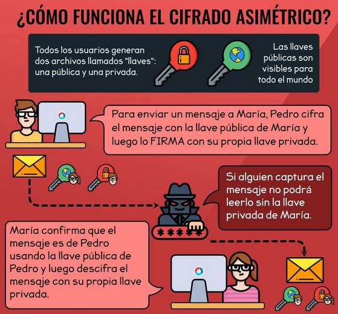
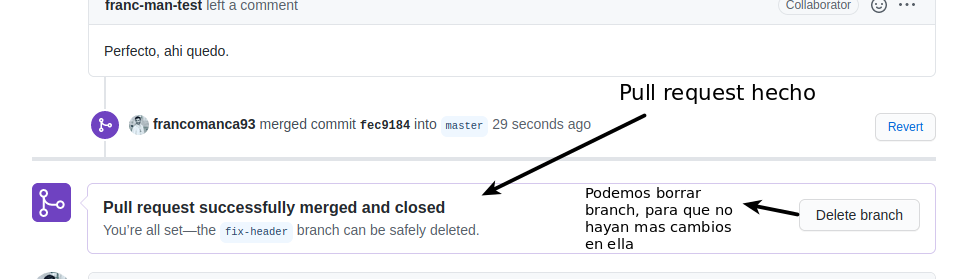

<div align="center">
  <h1>Curso profesional de Git y GitHub</h1>
</div>

<div align="center"> 
  
</div>

# Introducción al documento

El contenido de este documento son apuntes del [Curso profesional de Git y GitHub](https://platzi.com/clases/git-github/) y busca ser una guía. El mismo está dictado por [Freddy Vega](https://github.com/freddier) CEO y fundador de [Platzi](https://platzi.com).
***

## Tabla de contenido

- [Introducción a Git](#Introducción-a-Git)
    - [¿Qué es Git y GitHub?](#¿Qué-es-Git-y-GitHub?)
    - [¿Porque usar un sistema de control de versiones como Git?](#¿Porque-usar-un-sistema-de-control-de-versiones-como-Git?)
      - [Comandos iniciales en Git](#Comandos-iniciales-en-Git)
    - [Instalando](#Instalando)
    - [Editores de código, archivos binarios y de texto plano](#Editores-de-código,-archivos-binarios-y-de-texto-plano)
    - [Introducción a la terminal y línea de comando](#Introdución-a-la-terminal-y-línea-de-comando)
      - [Comandos básicos en la terminal](#Comandos-básicos-en-la-terminal)
- [Comandos básicos de Git](#Comandos-básicos-de-Git)
  - [¿Qué es el staging y los repositorios? Ciclo básico de trabajo en Git](#¿Qué-es-el-staging-y-los-repositorios?-Ciclo-básico-de-trabajo-en-Git)
    - [Ciclo de vida o estados de los archivos en Git](#Ciclo-de-vida-o-estados-de-los-archivos-en-Git)
    - [Ramas o branch's y cómo funciona un Merge en Git](#Ramas-o-branch's-y-cómo-funciona-un-Merge-en-Git)
    - [Crea un repositorio de Git y haz tu primer commit](#Crea-un-repositorio-de-Git-y-haz-tu-primer-commit)
    - [Configurando usuario en Git](#Configurando-usuario-en-Git)
    - [Analizar cambios en los archivos de tu proyecto con Git](#Analizar-cambios-en-los-archivos-de-tu-proyecto-con-Git)
- [Flujo de trabajo básico en Git](#Flujo-de-trabajo-básico-en-Git)
  - [Flujo de trabajo básico con un repositorio remoto](#Flujo-de-trabajo-básico-con-un-repositorio-remoto)
  - [Resumen del flujo de trabajo de git](#Resumen-del-flujo-de-trabajo-de-git)
  - [Introducción a las ramas o branches de Git](#Introducción-a-las-ramas-o-branches-de-Git)
  - [Fusión de ramas con Git merge](#Fusión-de-ramas-con-Git-merge)
  - [Solución de conflictos al hacer un merge](#Solución-de-conflictos-al-hacer-un-merge)
- [Trabajando con repositorios remotos en GitHub](#Trabajando-con-repositorios-remotos-en-GitHub)
  - [Uso de GitHub](#Uso-de-GitHub)
  - [Cómo funcionan las llaves públicas y privadas](#Cómo-funcionan-las-llaves-públicas-y-privadas)
  - [Configura tus llaves SSH en local](#Configura-tus-llaves-SSH-en-local)
  - [Visualización árbol en Git](#Visualización-árbol-en-Git)
  - [Tags y versiones en Git y GitHub](#Tags-y-versiones-en-Git-y-GitHub)
- [Flujos de trabajo profesionales](#Flujos-de-trabajo-profesionales)
  - [Haciendo merge de ramas de desarrollo a master](#Haciendo-merge-de-ramas-de-desarrollo-a-master)
  - [Pull Request](#Pull-Request)
  - [Utilizando Pull Requests en GitHub](#Utilizando-Pull-Requests-en-GitHub)
  - [Creando un Fork, contribuyendo a un repositorio](#Creando-un-Fork,-contribuyendo-a-un-repositorio)
  - [Ignorar archivos en el repositorio con .gitignore](#Ignorar-archivos-en-el-repositorio-con-.gitignore)
  - [-Readme.md es una excelente práctica](#-Readme.md-es-una-excelente-práctica)
  - [Tu sitio web público con GitHub Pages](#Tu-sitio-web-público-con-GitHub-Pages)
- [Multiples entornos de trabajo](#Multiples-entornos-de-trabajo)
  - [Git Rebase: reorganizando el trabajo realizado](#Git-Rebase:-reorganizando-el-trabajo-realizado)
  - [Git Stash: Guardar cambios en memoria y recuperarlos después](#Git-Stash:-Guardar-cambios-en-memoria-y-recuperarlos-después)
    - [git stash](#git-stash)
    - [Obtener elementos del stash](#Obtener-elementos-del-stash)
    - [Listado de elementos en el stash](#Listado-de-elementos-en-el-stash)
    - [Crear una rama con el stash](#Crear-una-rama-con-el-stash)
    - [Eliminar elementos del stash](#Eliminar-elementos-del-stash)
    - [Consideraciones](#Consideraciones)
  - [Git Clean: limpiar tu proyecto de archivos no deseados](#Git-Clean:-limpiar-tu-proyecto-de-archivos-no-deseados)
  - [Git cherry-pick: traer commits viejos al head de un branch](#Git-cherry-pick:-traer-commits-viejos-al-head-de-un-branch)
- [Comandos en Git para casos de emergencia](#Comandos-en-Git-para-casos-de-emergencia)
  - [Reconstruir commits en Git con amend](#Reconstruir-commits-en-Git-con-amend)
  - [Git Reset y Reflog: úsese en caso de emergencia](#Git-reset-y-Reflog:-úsese-en-caso-de-emergencia)
  - [Buscar en archivos y commits de Git con Grep y log](#Buscar-en-archivos-y-commits-de-Git-con-Grep-y-log)
- [Bonus](#Bonus)
  - [git shortlog: Visualizando a los commits](#git-shortlog:-Visualizando-a-los-commits)
  - [git blame: Vizualizando quien hace que](#git-blame:-Vizualizando-quien-hace-que)
  - [git branch: Visualizando ramas](#git-branch:-Visualizando-ramas)
- [Resumen de comandos y herramientas dev ops](#Resumen-de-comandos-y-herramientas-dev-ops)


## Introducción a Git

### ¿Qué es Git y GitHub?
[Git](https://git-scm.com/) es un software de control de versiones diseñado por [Linus Torvalds](https://es.wikipedia.org/wiki/Linus_Torvalds), pensando en la eficiencia y la confiabilidad del mantenimiento de versiones de aplicaciones cuando estas tienen un gran número de archivos de código fuente. 

En el siguiente enlace se encuentra el [libro oficial de Git](https://git-scm.com/book/es/v2)

<div align="center"> 
  
  <p></p>
</div>

En su lugar [GitHub](https://github.com/) es una forja para alojar proyectos utilizando el sistema de control de versiones Git. GitHub sería la red social de código para los programadores, tu propio curriculum vitae.

<div align="center"> 
  
  <p></p>
</div>

### ¿Porque usar un sistema de control de versiones como Git?

Un sistema de control de versiones como Git nos ayuda a guardar el historial de cambios y crecimiento de los archivos de nuestro proyecto.

En realidad, los cambios y diferencias entre las versiones de nuestros proyectos pueden tener similitudes, algunas veces los cambios pueden ser solo una palabra o una parte específica de un archivo específico. Git está optimizado para guardar todos estos cambios de forma atómica e incremental, o sea, aplicando cambios sobre los últimos cambios, estos sobre los cambios anteriores y así hasta el inicio de nuestro proyecto.

#### Comandos iniciales en Git

- ```$ git init```: Comando para iniciar nuestro repositorio, o sea, indicarle a Git que queremos usar su sistema de control de versiones en nuestro proyecto.
- ```$ git add nombre_archivo.txt```: Comando para que nuestro repositorio sepa de la existencia de un archivo o sus últimos cambios. Este comando no almacena las actualizaciones de forma definitiva, solo las guarda en algo que conocemos como “Staging Area”.
- ```$ git commit -m "Mensaje del commit"```: Comando para almacenar definitivamente todos los cambios que por ahora viven en el staging area. También podemos guardar un mensaje para recordar muy bien qué cambios hicimos en este commit con el argumento -m "Mensaje del commit".
- ```$ git add .```: Se guardan todos los archivos que hayan cambiado en la carpeta donde se hizo init.
- ```$ git status```:  Conocer el estado de modificaciones.
- ```$ git log nombre_archivo.txt```: Muestra el historial de commits.
- ```$ git show```: Muestra uno o mas objetos (blobs, tree, tags y commits), es decir es mucho más completo y detallado.
- ```git push```: Comando que sirve para mandar nuestros commits a un servidor remoto, un lugar donde todos podamos conectar nuestros proyectos.

### Instalando

Windows y Linux tienen comandos diferentes, graban el enter de formas diferentes y tienen muchas otras diferencias. Cuando instales Git Bash en Windows debes elegir si prefieres trabajar con la forma de Windows o la forma de UNIX (Linux y Mac) .

Ten en cuenta que, normalmente, los entornos de desarrollo profesionales tienen personas que usan sistemas operativos diferentes. Esto significa que, si todos podemos usar los mismos comandos, el trabajo resultará más fácil para todos en el equipo.

[Pagina oficial de Git para instalar en diferentes sistemas operativos](https://git-scm.com/book/es/v2/Inicio---Sobre-el-Control-de-Versiones-Instalaci%C3%B3n-de-Git)

#### Instalación en Linux
Cada distribución de Linux tiene un comando especial para instalar herramientas y actualizar el sistema.

En las distribuciones derivadas de Debian (como Ubuntu) el comando especial es `apt-get`, en Red Hat es yum y en ArchLinux es `pacman`. Cada distribución tiene su comando especial y debes averiguar cómo funciona para poder instalar Git.

Antes de hacer la instalación, debemos hacer una actualización del sistema. En nuestro caso, los comandos para hacerlo son `sudo apt-get update` y `sudo apt-get upgrade`.

Con el sistema actualizado, ahora sí podemos instalar Git y, en este caso, el comando para hacerlo es `sudo apt-get install git`. También puedes verificar que Git fue instalado correctamente con el comando `git --version`.

### Editores de código, archivos binarios y de texto plano

Un [editor de código](https://es.wikipedia.org/wiki/Editor_de_c%C3%B3digo_fuente) es una herramienta que nos brinda muchas ayudas para escribir código, algo así como un bloc de notas muy avanzado. Los editores más populares son [VSCode](https://code.visualstudio.com/), [Sublime Text](https://www.sublimetext.com/) y [Atom](https://atom.io/).

Tipos de archivos y sus diferencias:

- **Archivos de Texto (.txt)**: Texto plano normal y sin nada especial. Lo vemos igual sin importar dónde lo abramos, ya sea con el bloc de notas o con editores de texto avanzados.
- **Archivos RTF (.rtf)**: Podemos guardar texto con diferentes tamaños, estilos y colores. Pero si lo abrimos desde un editor de código, vamos a ver que es mucho más complejo que solo el texto plano. Esto es porque debe guardar todos los estilos del texto y, para esto, usa un código especial un poco difícil de entender y muy diferente a los textos con estilos especiales al que estamos acostumbrados.
- **Archivos de Word (.docx)**: Podemos guardar imágenes y texto con diferentes tamaños, estilos o colores. Al abrirlo desde un editor de código podemos ver que es código binario, muy difícil de entender y muy diferente al texto al que estamos acostumbrados. Esto es porque Word está optimizado para entender este código especial y representarlo gráficamente.

### Introducción a la terminal y línea de comando

Diferencias entre la estructura de archivos de Windows, Mac o Linux.

- La ruta principal en Windows es `C:\`, en UNIX es solo `/`.
- Windows no hace diferencia entre mayúsculas y minúsculas pero UNIX sí.

Recuerda que GitBash usa la ruta `/c` para dirigirse a `C:\` (o `/d` para dirigirse a `D:\`) en Windows. Por lo tanto, la ruta del usuario con el que estás trabajando es `/c/Users/Nombre de tu usuario`.

En UNIX `/home/nombre_de_tu_usuario`.

#### Comandos básicos en la terminal

- `$ pwd`: Nos muestra la ruta de carpetas en la que te encuentras ahora mismo.
- `$ mkdir`: Nos permite crear carpetas (por ejemplo, `$ mkdir Carpeta-Importante`).
- `$ touch`: Nos permite crear archivos (por ejemplo, `$ touch archivo.txt`).
- `$ rm`: Nos permite borrar un archivo o carpeta (por ejemplo, `$ rm archivo.txt`). *Mucho cuidado con este comando, puedes borrar todo tu disco duro*.
- `cat`: Ver el contenido de un archivo (por ejemplo, cat nombre-archivo.txt).

- `$ ls`: Nos permite ver los archivos de la carpeta donde estamos ahora mismo. Podemos usar uno o más argumentos para ver más información sobre estos archivos (los argumentos pueden ser `--` + el `nombre del argumento` o `-` + `una sola letra` o shortcut por cada argumento).

  - `$ ls -a`: Mostrar todos los archivos, incluso los ocultos.
  - `$ ls -l`: Ver todos los archivos como una lista.
  - `$ ls -al`: Unión del primer y segundo comando de arriba.
- `$ cd`: Nos permite navegar entre carpetas.
  - `$ cd /`: Ir a la ruta principal:
  - `$ cd` o `$ cd ~`: Ir a la ruta de tu usuario
  - `$ cd carpetasubcarpeta`: Navegar a una ruta dentro de la carpeta donde estamos ahora mismo.
  - `$ cd..` (cd + dos puntos): Regresar una carpeta hacia atrás.
  - Si quieres referirte al directorio en el que te encuentras ahora mismo puedes usar `$ cd .` (cd + un punto).
- `$ history`: Ver los últimos comandos que ejecutamos y un número especial con el que podemos repetir su ejecución.
- `$ ! `+ número: Ejecutar algún comando con el número que nos muestra el comando `history` (por ejemplo, `$ !72`).
- `$ clear`: Para limpiar la terminal. También podemos usar los atajos de teclado **Ctrl + L** o **Command + L**.

Todos estos comandos tiene una función de autocompletado, o sea, puedes escribir la primera parte y presionar la tecla **Tab** para que la terminal nos muestre todas las posibles carpetas o comandos que podemos ejecutar. Si presionas la tecla **Arriba** puedes ver el último comando que ejecutamos.

Recuerda que podemos descubrir todos los argumentos de un comando con el argumento `--help` (por ejemplo, `$ cat --help`).

## Comandos básicos de Git
### ¿Qué es el staging y los repositorios? Ciclo básico de trabajo en Git

Para iniciar un repositorio, o sea, activar el sistema de control de versiones de Git en tu proyecto, solo debes ejecutar el comando `$ git init`.

Este comando se encargará de crear dos cosas: 
- **Area de trabajo en RAM**, es decir, crear un área que conocemos como **Staging**, que guardará temporalmente nuestros archivos (cuando ejecutemos un comando especial para eso) y nos permitirá, más adelante, guardar estos cambios en el repositorio (también con un comando especial).
- **Crear un repositorio**, es es una carpeta .git, donde se guardará toda la base de datos con cambios atómicos de nuestro proyecto.

#### Ciclo de vida o estados de los archivos en Git
Cuando trabajamos con Git nuestros archivos pueden vivir y moverse entre 4 diferentes estados (cuando trabajamos con repositorios remotos pueden ser más estados, pero lo estudiaremos más adelante):

> Podemos ver en qué estado se encuentran nuestros archivos usando el comando `$ git status`. Cada archivo puede estar en un estado diferente.


- **Archivos Untracked**: Son archivos que NO viven dentro de Git, solo en el disco duro. Nunca han sido afectados por `git add`, así que Git no tiene registros de su existencia.

Recuerda que hay un caso muy raro donde los archivos tienen dos estados al mismo tiempo: staged y untracked. Esto pasa cuando guardas los cambios de un archivo en el área de Staging (con el comando `git add`), pero antes de hacer commit para guardar los cambios en el repositorio haces nuevos cambios que todavía no han sido guardados en el área de Staging.

- **Archivos Unstaged**: entiéndelos como archivos “Tracked pero Unstaged”. Son archivos que viven dentro de Git pero no han sido afectados por el comando git add ni mucho menos por git commit. Git tiene un registro de estos archivos, pero está desactualizado, sus últimas versiones solo están guardadas en el disco duro.

- **Archivos Staged**: son archivos en **Staging**. Viven dentro de Git y hay registro de ellos porque han sido afectados por el comando `$ git add`, aunque no sus últimos cambios. Git ya sabe de la existencia de estos últimos cambios, pero todavía no han sido guardados definitivamente en el repositorio porque falta ejecutar el comando `git commit`.

- **Archivos Tracked**: son los archivos que viven dentro de Git, no tienen cambios pendientes y sus últimas actualizaciones han sido guardadas en el repositorio gracias a los comandos `git add` y `git commit`.

<div align="center"> 
  
  <p></p>
</div>

Comandos para mover archivos entre los estados de Git

- `$ git status`: nos permite ver el estado de todos nuestros archivos y carpetas.
- `$ git add`: nos ayuda a mover archivos del Untracked o Unstaged al estado Staged. Podemos usar `git nombre-del-archivo-o-carpeta` para añadir archivos y carpetas individuales o `git add -A` para mover todos los archivos de nuestro proyecto (tanto Untrackeds como unstageds).
- `$ git reset HEAD`: nos ayuda a sacar archivos del estado Staged para devolverlos a su estado anterior. Si los archivos venían de Unstaged, vuelven allí. Y lo mismo si venían de Untracked.
- `$ git commit`: nos ayuda a mover archivos de **Staged a Traked**. Esta es una ocasión especial, los archivos han sido guardado o actualizados en el repositorio. Git nos pedirá que dejemos un mensaje para recordar los cambios que hicimos y podemos usar el argumento -m para escribirlo (`$ git commit -m "mensaje"`).
- `$ git rm`: este comando necesita alguno de los siguientes argumentos para poder ejecutarse correctamente:
  - `$ git rm --cached`: Mueve los archivos que le indiquemos al estado Untracked.
  - `$ git rm --force`: Elimina los archivos de Git y del disco duro. Git guarda el registro de la existencia de los archivos, por lo que podremos recuperarlos si es necesario (pero debemos usar comandos más avanzados).

### Ramas o branch's y cómo funciona un Merge en Git

Git es una base de datos muy precisa con todos los cambios y crecimiento que ha tenido nuestro proyecto. Los commits son la única forma de tener un registro de los cambios. Pero las ramas amplifican mucho más el potencial de Git.

**Todos los commits se aplican sobre una rama.** Por defecto, siempre empezamos en la rama master (pero puedes cambiarle el nombre si no te gusta) y creamos nuevas ramas, a partir de esta, para crear flujos de trabajo independientes.

Crear una nueva rama se trata de copiar un commit (de cualquier rama), pasarlo a otro lado (a otra rama) y continuar el trabajo de una parte específica de nuestro proyecto sin afectar el flujo de trabajo principal (que continúa en la rama master o la rama principal).

Los equipos de desarrollo tienen un estándar: 
- Todo lo que esté en la rama **master** va a producción. 
- Las nuevas features, características y experimentos van en una rama **“development”** (para unirse a master cuando estén definitivamente listas).

<div align="center"> 
  
  <p></p>
</div>

- Los issues o errores se solucionan en una rama **“hotfix”** para unirse a master tan pronto como sea posible.

<div align="center"> 
  
  <p></p>
</div>

Crear una nueva rama lo conocemos como **Checkout**. Unir dos ramas lo conocemos como **Merge**.

Podemos crear todas las ramas y commits que queramos. De hecho, podemos aprovechar el registro de cambios de Git para crear ramas, traer versiones viejas del código, arreglarlas y combinarlas de nuevo para mejorar el proyecto.

Solo ten en cuenta que combinar estas ramas (sí, hacer “merge”) puede generar conflictos. Algunos archivos pueden ser diferentes en ambas ramas. Git es muy inteligente y puede intentar unir estos cambios automáticamente, pero no siempre funciona. En algunos casos, somos nosotros los que debemos resolver estos conflictos “a mano”.

<div align="center"> 
  
  <p>Rama Master, Developer y Horfix(bugfixing) juntas</p>
</div>

### Crea un repositorio de Git y haz tu primer commit

Si quieres ver los archivos ocultos de una carpeta en VSCode vas a de `File > Preference > Settings > "Files: Exclude"`. Removemos el archivo oculto que queremos mostrar con *"Remove Exclude Item"*. Si lo queremos argregar a archivos ocultos nuevamente clickeamos en *"Add Pattern"* y agregamos el archivo `**/.nombre_del_archivo_o_carpeta_oculta`. Desde terminal tambien los podemos ver si el comando `$ ls -al`.

Le indicaremos a Git que queremos crear un nuevo repositorio para utilizar su sistema de control de versiones. Solo debemos posicionarnos en la carpeta raíz de nuestro proyecto y ejecutar el comando `git init`.

Recuerda que al ejecutar este comando (y de aquí en adelante) vamos a tener una nueva carpeta oculta llamada `.git` con toda la base de datos con cambios atómicos en nuestro proyecto.

### Configurando usuario en Git

Recuerda que Git está optimizado para trabajar en equipo, por lo tanto, debemos darle un poco de información sobre nosotros. No debemos hacerlo todas las veces que ejecutamos un comando, basta con ejecutar solo una sola vez los siguientes comandos con tu información:

#### Usuario global
```
$ git config --global user.email "tu@email.com"
$ git config --global user.name "Tu Nombre"
```

#### Usuario por repositorio
Es posible configurar un email y nombre distinto para cada repositorio. Si te paras en la raíz de tu copia local puedes editar usuario e email de la siguiente manera:

```
git config user.name "username-de-user-que-edita-repo"
git config user.email "usuario-que-edita-repo@email.com"
```
Esa configuración pisa la configuración global para ese repositorio en particular.

Todo lo que se indicado guarda relación con el email al cual se atribuye la autoría del commit, que no tiene ninguna relación con la cuenta de github que se utilice para interactuar con el remoto via pull/push.


Existen muchas otras configuraciones de Git que puedes encontrar ejecutando el comando `git config --list` (o solo `git config` para ver una explicación más detallada).

### Analizar cambios en los archivos de tu proyecto con Git

El comando `$ git show` nos muestra los cambios que han existido sobre un archivo y es muy útil para detectar cuándo se produjeron ciertos cambios, qué se rompió y cómo lo podemos solucionar. Pero podemos ser más detallados.

Si queremos ver la diferencia entre una versión y otra, no necesariamente todos los cambios desde la creación del archivo, podemos usar el comando `$ git diff commitA commitB`.

Recuerda que puedes obtener el ID de tus commits con el comando `$ git log`.

### Volver en el tiempo en nuestro repositorio utilizando reset y checkout

El comando `git checkout + ID del commit` nos permite viajar en el tiempo. Podemos volver a cualquier versión anterior de un archivo específico o incluso del proyecto entero. Esta también es la forma de crear ramas y movernos entre ellas.

<div align="center"> 
  
  <p></p>
</div>

También hay una forma de hacerlo un poco más “ruda”: usando el comando `git reset`. En este caso, no solo “volvemos en el tiempo”, sino que borramos los cambios que hicimos después de este commit.

Hay dos formas de usar `git reset`: 
- Con el argumento `--hard`, borrando toda la información que tengamos en el área de history (y perdiendo todo para siempre). 
- Un poco más seguro, con el argumento `--soft`, que mantiene allí los archivos del área de staging para que podamos aplicar nuestros últimos cambios pero desde un commit anterior.

<div align="center"> 
  
  <p></p>
</div>

### Git reset vs Git rm
Estudio mas a fondo de los comando Git reset y git rm. Estos son comandos con utilidades muy diferentes, pero aún así se confunden muy fácilmente.

#### git rm

Este comando nos ayuda a eliminar archivos de Git sin eliminar su historial del sistema de versiones. Esto quiere decir que si necesitamos recuperar el archivo solo debemos “viajar en el tiempo” y recuperar el último commit antes de borrar el archivo en cuestión.

Recuerda que git rm no puede usarse así nomás. Debemos usar uno de los flags para indicarle a Git cómo eliminar los archivos que ya no necesitamos en la última versión del proyecto:

- `$ git rm --cached`: Elimina los archivos del área de Staging y del próximo commit pero los mantiene en nuestro disco duro.
- `$ git rm --force`: Elimina los archivos de Git y del disco duro. Git siempre guarda todo, por lo que podemos acceder al registro de la existencia de los archivos, de modo que podremos recuperarlos si es necesario (pero debemos usar comandos más avanzados).

#### git reset

Este comando nos ayuda a volver en el tiempo. Pero no como `git checkout` que nos deja ir, mirar, pasear y volver. Con git reset volvemos al pasado sin la posibilidad de volver al futuro. Borramos la historia y la debemos sobreescribir. No hay vuelta atrás.

Este comando es **muy peligroso** y debemos usarlo solo en caso de emergencia. Recuerda que debemos usar alguna de estas dos opciones:


- `$ git reset --soft <id commit>`: Borramos todo el historial y los registros de Git pero guardamos los cambios que tengamos en Staging, así podemos aplicar las últimas actualizaciones a un nuevo commit.
- `$ git reset --hard <id commit>`: Borra todo. Todo todito, absolutamente todo. Toda la información de los commits y del área de staging se borra del historial.

**¡Pero todavía falta algo!**
- `$ git reset HEAD`: Este es el comando para sacar archivos del área de Staging. No para borrarlos ni nada de eso, solo para que los últimos cambios de estos archivos no se envíen al último commit, a menos que cambiemos de opinión y los incluyamos de nuevo en staging con git add, por supuesto.

**¿Por qué esto es importante?**

Imagina el siguiente caso:

Hacemos cambios en los archivos de un proyecto para una nueva actualización. Todos los archivos con cambios se mueven al área de staging con el comando git add. Pero te das cuenta de que uno de esos archivos no está listo todavía. Actualizaste el archivo pero ese cambio no debe ir en el próximo commit por ahora.

**¿Qué podemos hacer?**

Bueno, todos los cambios están en el área de Staging, incluido el archivo con los cambios que no están listos. Esto significa que debemos sacar ese archivo de Staging para poder hacer commit de todos los demás.

¡Al usar `git rm` lo que haremos será eliminar este archivo completamente de git! Todavía tendremos el historial de cambios de este archivo, con la eliminación del archivo como su última actualización. Recuerda que en este caso no buscábamos eliminar un archivo, solo dejarlo como estaba y actualizarlo después, no en este commit.

En cambio, si usamos `git reset HEAD`, lo único que haremos será mover estos cambios de Staging a Unstaged. Seguiremos teniendo los últimos cambios del archivo, el repositorio mantendrá el archivo (no con sus últimos cambios pero sí con los últimos en los que hicimos commit) y no habremos perdido nada.

**Conclusión:** Lo mejor que puedes hacer para salvar tu puesto y evitar un incendio en tu trabajo es conocer muy bien la diferencia y los riesgos de todos los comandos de Git.


## Flujo de trabajo básico en Git
### Flujo de trabajo básico con un repositorio remoto

1. Creamos nuestro Directorio de trabajo. 
2. Iniciamos nuestro staging y repositorio local con `$ git init`.

<div align="center"> 
  <table>
    <tr>
    <td></td>
    <td></td>
    </tr>
  </table>
</div>

> La magia de git es que cada persona que tenga una copia del repositorio tiene el historial completo del proyecto. 

3. Empezamos agregando archivos al área de staging con `$ git add nombre_archivo.extension` o agregamos todo lo hecho con `$ git add .`

Si el archio es agregado estará **tracked** o restreado, de lo contrario no estará restreado o **untracked** y por ende no se guardará en git. 
Esto es temporal ya que desaparecerá si reseteamos o apagamos nuestra máquina, debido al __garbage collector__

<div align="center"> 
  <table>
    <tr>
    <td></td>
    <td></td>
    </tr>
  </table>
</div>

4. Enviamos nuestro archivo al repositorio local con `git commit -m "MENSAJE DEL COMMIT"`

<div align="center"> 
  <table>
    <tr>
    <td></td>
    </tr>
  </table>
</div>

Por ahora, nuestro proyecto vive únicamente en nuestra computadora. Repitiendo los pasos 3 y 4, crearemos una historia de nuestro proyecto. Y esto significa que no hay forma de que otros miembros del equipo trabajen en él.

Para solucionar esto están los servidores remotos: un nuevo estado que deben seguir nuestros archivos para conectarse y trabajar con equipos de cualquier parte del mundo.

Estos servidores remotos pueden estar alojados en **GitHub, GitLab, BitBucket, entre otros**. Lo que van a hacer es guardar el mismo repositorio que tienes en tu computadora y darnos una URL con la que todos podremos acceder a los archivos del proyecto para descargarlos, hacer cambios y volverlos a enviar al servidor remoto para que otras personas vean los cambios, comparen sus versiones y creen nuevas propuestas para el proyecto.

Nuestro proyecto puede estar alojado en un servido remoto. ¿Como hacemos para traernos un proyecto remoto?

5. `$ git clone url_del_servidor_remoto`: Nos permite descargar los archivos de la última versión de la rama principal y todo el historial de cambios en la carpeta **.git**.

6. `$ git push`: Luego de hacer `git add` y `git commit` debemos ejecutar este comando para mandar los cambios al _servidor remoto_.

Este paso se puede repetir tantas veces como sea necesario si enviamos commit's a nuestro repo.
<div align="center"> 
  <table>
    <tr>
    <td></td>
    <td></td>
    </tr>
  </table>
</div>

7. `$ git fetch`: Lo usamos para traer actualizaciones del servidor remoto y guardarlas en nuestro repositorio local (en caso de que hayan, por supuesto). Esto no lo trae a nuestros archivos, solo al repo local. 
8. `$ git merge`: También usamos el comando `git fetch` con servidores remotos. Lo necesitamos para combinar los últimos cambios del servidor remoto y nuestro directorio de trabajo.

<div align="center"> 
  <table>
    <tr>
    <td></td>
    <td></td>
    </tr>
  </table>
</div>

9. `$ git pull`: Básicamente, `git fetch` y `git merge` al mismo tiempo.

<div align="center"> 
  <table>
    <tr>
    <td></td>
    </tr>
  </table>
</div>

### Resumen del flujo de trabajo de git

<div align="center"> 
  
</div>

### Introducción a las ramas o branches de Git

Las ramas son la forma de hacer cambios en nuestro proyecto sin afectar el flujo de trabajo de la rama principal. Esto porque queremos trabajar una parte muy específica de la aplicación o simplemente experimentar.

Cuando uno hace una nueva rama, en realidad esta haciendo una copia del último commit en otro _"lado"_ para que los cambios sean independientes. 

La cabecera o **HEAD** representan la rama y el commit de esa rama donde estamos trabajando. Por defecto, esta cabecera aparecerá en el último commit de nuestra rama principal. Pero podemos cambiarlo al crear una rama.

- `$ git status`: Para revisar en que rama me encuentro.

<div align="center"> 
  
</div>

- **Comandos branch**
  - `$ git branch nombre_rama`: Crea una nueva rama con el nombre __nombre_rama__.
  - `$ git branch -l`: Lista todas las ramas que existen.
  - `$ git branch -d nombre_rama`: Elimina la rama con el nombre __nombre_rama__. Con *-d* se fuerza el borrado.
  - `$ git branch -m nombre_rama rama_nueva`: Permite renombrar __nombre_rama__ con __rama_nueva__.

- **Comando checkout**
  - `$ git checkout nombre_rama`: Permite moverse entre ramas hacia la ramma __nombre_rama__.
  - `$ git checkout -b nombre_rama`: Crea una nueva rama con el nombre __nombre_rama__ y se posiciona en ella.

Tambien podemos movernos en el tiempo a cualquier otro commit de cualquier otra rama con los comandos.
- `$ git reset id-commit`
- `$ git checkout rama-o-id-commit`

Cada vez que nos movemos de una rama a otra los archivos también vuelven al estado en el que se encuentren.

En resumen, las ramas en git son importantes porque te permiten independizar los cambios en un proyecto de tal forma que se pueda realizar avances optimizando el tiempo y el orden. La herramienta es útil porque se pueden fusionar dichos cambios sin perder registro de las versiones anteriores. 

### Fusión de ramas con Git merge

El comando `git merge` nos permite crear un nuevo commit con la combinación de dos ramas (la rama donde nos encontramos cuando ejecutamos el comando y la rama que indiquemos después del comando).

```py
# Crear un nuevo commit en la rama master combinando
# los cambios de la rama que estamos editando (ejemplo: developer):
$ git checkout master
$ git merge developer

# Crear un nuevo commit en la rama developer combinando
# los cambios de cualquier otra rama:
$ git checkout developer
$ git merge cualquier-otra-rama
```
<div align="center"> 
  
</div>

Git sabe qué cambios queremos conservar de una rama y qué otros de la otra. El problema es que no siempre puede adivinar, sobretodo en algunos casos donde dos ramas tienen actualizaciones diferentes en ciertas líneas en los archivos. Esto lo conocemos como un **conflicto** y aprenderemos a solucionarlos en la siguiente sección.

Recuerda que al ejecutar el comando `git checkout` para cambiar de rama o commit puedes perder el trabajo que no hayas guardado. **Guarda tus cambios con `git commit -am "MENSAJE"` antes de hacer `git checkout`**.

### Solución de conflictos al hacer un merge

**Git nunca borra nada** a menos que nosotros se lo indiquemos. Cuando usamos los comandos `git merge` o `git checkout` estamos cambiando de rama o creando un nuevo commit, no borrando ramas ni commits (recuerda que puedes borrar commits con `git reset` y ramas con `git branch -d`).

Git es muy inteligente y puede resolver algunos conflictos automáticamente: cambios, nuevas líneas, entre otros. Pero algunas veces no sabe cómo resolver estas diferencias, por ejemplo, cuando dos ramas diferentes hacen cambios distintos a una misma línea.

<div align="center"> 
  
</div>

Esto lo conocemos como **conflicto** y lo podemos resolver manualmente, solo debemos hacer el merge, ir a nuestro editor de código y elegir si queremos quedarnos con alguna de estas dos versiones o algo diferente. Algunos editores de código como **VSCode** nos ayudan a resolver estos conflictos sin necesidad de borrar o escribir líneas de texto, basta con hundir un botón y guardar el archivo.

- Como veriamos un conflicto desde un editor de texto plano. 
```
            <div id="cabecera">
                Hyperblog
<<<<<<< HEAD
                <span id="tagline">Tu blog maestro</span>
=======
                <span id="tagline">Tu blog de la cabecera. </span>
>>>>>>> cabecera
            </div>
```
- Como veriamos un conflicto en VSCode
<div align="center"> 
  
</div>

**¿Como resolvemos el conflicto?** 
- Debemos crear un nuevo commit para aplicar los cambios del merge.
- Si Git puede resolver el conflicto hará commit automáticamente. 
- Pero, en caso de no pueda resolverlo, debemos solucionarlo y hacer el commit. Vamos a las lineas donde están los conflictos y comparamos los códigos. Debemos tomar una decisión, la mejor sería la que resuelva el problema de forma mas eficiente y efectiva.

Los archivos con conflictos por el comando `git merge` entran en un nuevo estado que conocemos como **Unmerged**. Funcionan muy parecido a los archivos en estado **Unstaged**, algo así como un estado intermedio entre **Untracked y Unstaged**, solo debemos ejecutar `git add` para pasarlos al área de staging y `git commit` para aplicar los cambios en el repositorio.


## Trabajando con repositorios remotos en GitHub
### Uso de GitHub

<div align="center"> 
  
  <p></p>
</div>

GitHub es una plataforma que nos permite guardar repositorios de Git que podemos usar como servidores remotos y ejecutar algunos comandos de forma visual e interactiva (sin necesidad de la consola de comandos).

Luego de crear nuestra cuenta, podemos crear o importar repositorios, crear organizaciones y proyectos de trabajo, descubrir repositorios de otras personas, contribuir a esos proyectos, dar estrellas y muchas otras cosas.

El **`README.md`** es el archivo que veremos por defecto al entrar a un repositorio. Es una muy buena práctica configurarlo para describir el proyecto, los requerimientos y las instrucciones que debemos seguir para contribuir correctamente.

Para clonar un repositorio desde **GitHub** (o cualquier otro servidor remoto) debemos copiar la URL (por ahora, usando HTTPS) y ejecutar el comando `git clone + la URL` que acabamos de copiar. Esto descargara la versión de nuestro proyecto que se encuentra en GitHub.

Sin embargo, esto solo funciona para las personas que quieren empezar a contribuir en el proyecto. Si queremos conectar el repositorio de GitHub con nuestro repositorio local, el que creamos con `git init`, debemos ejecutar las siguientes instrucciones:


1. Guardar la URL del repositorio de GitHub con el nombre de origin.

<div align="center"> 
  
  <p></p>
</div>

- `$ git remote add origin URL`

2. Verificar que la URL se haya guardado correctamente:

- `$ git remote`
- `$ git remote -v`

3. Traer la versión del repositorio remoto y hacer merge para crear un commit con los archivos de ambas partes. Podemos usar:
- `$ git fecht`
- `$ git merge`
- `$ git pull origin master`
- `$ git pull origin master --allow-unrelated-histories` (Este ultimo es para por si se presentan conflictos).

4. Ahora sí podemos hacer `git push` para guardar los cambios de nuestro repositorio local en GitHub:
- `git push origin master`

### Cómo funcionan las llaves públicas y privadas

Las llaves públicas y privadas nos ayudan a cifrar y descifrar nuestros archivos de forma que los podamos compartir sin correr el riesgo de que sean interceptados por personas con malas intenciones.

La forma de hacerlo es la siguiente:

1. Ambas personas deben crear su llave pública y privada.
2. Ambas personas pueden compartir su llave pública a las otras partes (recuerda que esta llave es pública, no hay problema si la “interceptan”).
3. La persona que quiere compartir un mensaje puede usar la llave pública de la otra persona para cifrar los archivos y asegurarse que solo puedan ser descifrados con la llave privada de la persona con la que queremos compartir el mensaje.
4. El mensaje está cifrado y puede ser enviado a la otra persona sin problemas en caso de que los archivos sean interceptados.
5. La persona a la que enviamos el mensaje cifrado puede usar su llave privada para descifrar el mensaje y ver los archivos.

<div align="center"> 
  
  <p></p>
</div>

Puedes compartir tu llave pública pero nunca tu llave privada.

En la siguiente clase vamos a crear nuestras llaves para compartir archivos con GitHub sin correr el riesgo de que sean interceptados.

### Configura tus llaves SSH en local

Si conectamos GitHub por https nuestro usuario y contraseña se guardan en el entorno local, y eres vulnerable a password cracking. 

Si conectamos Github por SSH, además de que la conexión es más segura, no tenemos que volver a ingresar nuestras credenciales de Github.

Para la conexión con Github, al enviarle nuestra llave pública Github nos envía cifrado su propia llave pública. 

Las llaves SSH no son por repositorio, son por persona

Los pasos para la creación y configuración de nuestra llave so los siguientes: 

1. Generar tus llaves SSH. Recuerda que es muy buena idea proteger tu llave privada con una contraseña.

- `$ ssh-keygen -t rsa -b 4096 -C "tu@email.com"`


<div align="center"> 
  
  <p></p>
</div>

2. Revisar que las llaves han sido creadas con exito en una carpeta oculta **.ssh**.

<div align="center"> 
  
  <p></p>
</div>

3. Terminar de configurar nuestro sistema.

En Windows y Linux:

- Encender el "servidor" de llaves SSH de tu computadora:
    - `$ eval $(ssh-agent -s)`
```
# Deberia aparecer en consola algo como lo siguiente
Agent pid 24203
```
- Añadir tu llave SSH a este "servidor":
  - `$ ssh-add ruta-donde-guardaste-tu-llave-privada`

### Conexión a GitHub con SSH

Luego de crear nuestras llaves SSH podemos entregarle la llave pública a GitHub para comunicarnos de forma segura y sin necesidad de escribir nuestro usuario y contraseña todo el tiempo.

Para esto debes entrar a la [Configuración de Llaves SSH en GitHub](https://github.com/settings/keys), crear una nueva llave con el nombre que le quieras dar y el contenido de la llave pública de tu computadora.

Ahora podemos actualizar la URL que guardamos en nuestro repositorio remoto, solo que, en vez de guardar la URL con HTTPS, vamos a usar la URL con SSH. Los pasos son los siguientes:

> NOTA: **origin** es un nombre estandar en la industria que se usa para ponerle a nuestros repositorios. Les podriamos poner otro nombre si quisieramos. 
1. Vemos con quien está enlazado nuestro repositorio con:
- `git remote -v`
2. Si no lo tenemos enlazado con ssh, ingresamos el siguiente comando. 
- `$ git remote set-url origin url-ssh-del-repositorio-en-github`

<div align="center"> 
  
  <p></p>
</div>

3. Enlazamos nuestro repositorio local con el remoto:
- `git pull`

4. Vamos a usar pull y nos traemos los posibles cambios que existan en el repositorio remoto con:
- `git pull nombre_rama_repositorio_remoto nombre_rama_rapo_local` >>> Ejemplo:
`git pull origin master`

5. Enviamos nuestros cambios al repositorio remoto:
- `git push origin master`

### Visualización árbol en Git

Para ver el historial de cambios de mi rama lo hago con: 
- `$ git log`

Si quiero ver completo los cambios de mi proyecto lo podemos hacer con el comando:
- `$ git log --all`

Si quiero ver un arbol con los log:
- `$ git log --all --graph`

Por último, si quiero ver el arbol comprimido por consola lo hacemos de la siguiente manera:
- `$ git log --all --graph --decorate --oneline`

El siguiente gráfico corresponde a un proyecto de juguete ["hyperblog"](https://github.com/francomanca93/hyperblog) para un curso profesional de Git y GitHub
<div align="center"> 
  
  <p></p>
</div>

El comando al ser grande, podemos no acordarnos entonces podemos ponerle un alias de la siguiente forma:
- `$ alias arbolito="git log --all --graph --decorate --oneline"`

### Tags y versiones en Git y GitHub

Los tags o etiquetas nos permiten asignar versiones a los commits con cambios más importantes o significativos de nuestro proyecto. Esta funcionalidad se usa típicamente para marcar versiones de lanzamiento (v1.0 por ejemplo)

Comandos para trabajar con etiquetas:

- Crear un nuevo tag y asignarlo a un commit:

`$ git tag -a nombre-del-tag id-del-commit`

Ejemplo: `$ git tag -a v0.1 -m "Resultado de las primeras clases del curso" af03c00 `

- Borrar un tag en el repositorio local:

`$ git tag -d nombre-del-tag`

- Listar los tags de nuestro repositorio local: 

`$ git tag`

`$ git show-ref --tags`

- Publicar un tag en el repositorio remoto:

`$ git push origin --tags`

- Borrar un tag del repositorio remoto: 

`$ git tag -d nombre-del-tag`>>> Para borrarlo del repo local

`$ git push origin :refs/tags/nombre-del-tag`>>> Para desvicularlo y borrarlo de GitHub

> **Conclusión**: Los tags sirven para marcar un punto específico en la historia de nuestro trabajo(para los releases). De esta forma, podemos hacer un seguimiento al progreso de nuestro proyecto e identificar los cambios más fácilmente entre cada versión. Tambien podriamos hacer un checkout a uno de los tags.

### Manejo de ramas en GitHub

Puedes trabajar con ramas que nunca envías a GitHub, así como pueden haber ramas importantes en GitHub que nunca usas en el repositorio local. Lo importante es que aprendas a manejarlas para trabajar profesionalmente.
<div align="center"> 
  
  <p></p>
</div>

- Crear una rama en el repositorio local: 

`$ git branch nombre-de-la-rama`

`$ git checkout -b nombre-de-la-rama`

- Publicar una rama local al repositorio remoto: 

`$ git push origin nombre-de-la-rama`

- Eliminar una rama remota una rama remota (en GitHub). Básicamente, lo que hace es eliminar el apuntador del servidor: 

`$ git pull origin --delete nombre-rama`

- Revisamo en GitHub que las ramas fueron enviadas correctamente. 
<div align="center"> 
  
  <p></p>
</div>

Podemos ver gráficamente nuestro entorno y flujo de trabajo local con Git usando el comando la extension [Git Graph](https://marketplace.visualstudio.com/items?itemName=mhutchie.git-graph) de VSCode.

El [proyecto hyperblog](https://github.com/francomanca93/hyperblog) se vería como sigue: 
<div align="center"> 
  
</div>

> **Conclusión**: Las ramas son importantes ya que representan un área de trabajo independiente de desarrollo dentro de nuestro proyecto. Al igual que en nuestro repositorio local, en GitHub podemos trabajar con ramas y compararlos para unirlos con nuestros cambios, utiizando Git.

### Configurar múltiples colaboradores en un repositorio de GitHub

Por defecto, cualquier persona puede clonar o descargar tu proyecto desde GitHub, pero no pueden crear commits, ni ramas, ni nada.

Existen varias formas de solucionar esto para poder aceptar contribuciones. Una de ellas es añadir a cada persona de nuestro equipo como colaborador de nuestro repositorio.

Solo debemos entrar a la configuración de colaboradores de nuestro proyecto (`Repositorio > Settings > Manage access > Invite a collaborator`) y añadir el email o username de los nuevos colaboradores.

<div align="center"> 
  
</div>

## Flujos de trabajo profesionales

### Haciendo merge de ramas de desarrollo a master

1. Crear ramas. 
1. Agregar a los colaboradores del proyecto al proyecto.
1. Asignar una rama a cada programador
1. El programador baja el repositorio con `git pull origin master`
1. El programador cambia de rama a la asignada por el product  manager, CTO o encargado el proyecto.
1. El programador trabaja en esa rama y hace commits
1. El programador comprueba que no hayan cambios en sus ramas y las actualiza con `git pull origin #nombre_rama`
1. El programador sube su trabajo con `git push origin #nombre_rama`
1. El jefe baja y unifica todos los cambios con `git merge #nombre_rama`.

En la siguiente imagen se puede ver un pequeño flujo de trabajo con el [proyecto hyperblog](https://github.com/francomanca93/hyperblog) y con dos autores y dos ramas diferentes. Luego a estas se le hacen merge a master.
<div align="center"> 
  
</div>

### Pull Request

En un entorno profesional normalmente se bloquea la rama **master**, y para enviar código a dicha rama pasa por un **code review** y luego de su aprobación se unen códigos con los llamados **pull request**.

Para realizar pruebas enviamos el código a servidores que normalmente los llamamos **staging develop** (servidores de pruebas) luego de que se realizan las pruebas pertinentes tanto de código como de la aplicación estos pasan a el servidor de producción con el ya antes mencionado **pull request**.
<div align="center"> 
  
</div>

Un **pull requests** es la acción de validar un código que se va a _mergear_ de una rama a otra. En este proceso de validación pueden entrar los factores que queramos: Builds (validaciones automáticas), asignación de código a tareas, validaciones manuales por parte del equipo, despliegue, etc. 

<div align="center"> 
  
</div>


Los **pull requests** también son importantes porque permiten a personas que no son colaboradores, trabajar y apoyar nuestro proyecto. 

### Utilizando Pull Requests en GitHub

Un **pull request** es una funcionalidad de github (en gitlab llamada **merge request** y en bitbucket **push request**), en la que un colaborador pide que revisen sus cambios antes de hacer merge a una rama, normalmente master.

Al hacer un pull request se genera una conversación que pueden seguir los demás usuarios del repositorio, así como autorizar y rechazar los cambios.

El flujo del pull request es el siguiente:

1. Se trabaja en una rama paralela los cambios que se desean (`git checkout nombre_rama`)
2. Se hace un commit a la rama (`git commit -am "Comentario"`)
3. Se suben al remoto los cambios (`git push origin nombre_rama`)
4. En GitHub se hace el pull request comparando la rama master con la rama del fix (o la que hayamos creado para tal próposito).

- Usuario 1. Hará el merge a la rama master. 
<div align="center"> 
  
</div>

- Luego nos iremos a una pantalla como la siguiente:
<div align="center"> 
  
</div>


5. Uno, o varios colaboradores revisan que el código sea correcto y dan feedback (en el chat del pull request).

- Usuario 2 (u otros reviewers) verán que hay pull request o les llegará un mensaje a la bandeja de entrada.

<div align="center"> 
  
</div>

- Le aparecerá una pantalla como la siguiente: 

<div align="center"> 
  
</div>

- El usuario reviewer puede ver los cambios y puede:
  - Comentar
  - Aprobar
  - Pedir que se haga cambios
<div align="center"> 
  
</div>

- Si pedimos una corrección nuestro pull request se verá como sigue:

<div align="center"> 
  
</div>

6. El colaborador  o el que está a cargo de la rama hace los cambios que desea/debe en la rama y lo vuelve a subir al remoto (automáticamente jala la historia de los cambios que se hagan en la rama, en remoto).

<div align="center"> 
  
</div>

7. Se aceptan los cambios en GitHub (por parte de el/la/los reviewers)

<div align="center"> 
  
</div>

8. Se hace merge a master desde GitHub

<div align="center"> 
  
</div>

- Finalmente el pull request queda como sigue:
<div align="center"> 
  
</div>

> Importante: Cuando se modifica una rama, también se modifica el pull request.

### Creando un Fork, contribuyendo a un repositorio

Para participar en un proyecto existente, en el que no tengas permisos de escritura, puedes bifurcarlo o hacer un **fork**. Esto consiste en crear una copia completa del repositorio totalmente bajo tu control y en tu cuenta.

<div align="center"> 
  
</div>

- Los pasos para bajarse el repositorio: 
1. Hacer Fork Directamente en GitHub
2. Hacer un clone del repositorio: `git clone url:repositorio_https_o_ssh`
3. Ahora se puede modificar el repositorio en local. 
4. Hacer push con cambios realizados: `git push origin master`
5. Hacer la petición de una Pull Request (Hasta esperar aprobación).

- Los pasos para descargar cambios directamente del repositorio maestro (El dueño es el Admin “Quien aprueba ó no las Pull Request”):
1. Agrego un nuevo enlace al repositorio: `git remote add “Nombre (Preferencia upstream)” url:repositorio_https_o_ssh`
2. Verificar que se realizo correctamente: `git remote -v`
3. Descargar cambios: `git pull upstream master`
4. Mandar los cambios de upstream a nuestro origin `git push origin master`

<div align="center"> 
  
</div>

Cuando hacemos un fork de un repositorio, se hace una copia exacta del repositorio original que podemos utilizar como un repositorio git cualquiera. Después de hacer fork tendremos dos repositorios git idénticos pero con distinta URL. Finalizado el proceso tendremos dos respositorios independientes que pueden cada uno evolucionar de forma autónoma. GitHub nos permite a su vez comparar los cambios con el proyecto original para poder aportar mediante un pull request. 

### Ignorar archivos en el repositorio con .gitignore
Por diversas razones, **no todos los archivos** que agregas a un proyecto **deberían guardarse** en un repositorio, ésto porque hay archivos que no todo el mundo debería de ver, y hay archivos que al estar en el repositorio alentan el proceso de desarrollo (por ejemplo los binary large objects, blob, que se tardan en descargarse).


Para que no se suban estos archivos no deseados se puede crear un archivo con el nombre **.gitignore** en la raíz del repositorio con las reglas para los archivos que no se deberían subir (ver [sintaxis de los .gitignore](https://git-scm.com/docs/gitignore)).


Las razones principales para tomar la decisión de no agregar un archivo a un repositorio son:

- Es un archivo con contraseñas (normalmente con la extensión .env)
- Es un blob (binary large object, objeto binario grande), mismos que son difíciles de gestionar en git.
- Son archivos que se generan corriendo comandos, por ejemplo la carpeta node_modules que genera npm al correr el comando npm install

### -Readme.md es una excelente práctica

**-README.md** es una excelente práctica en tus proyectos, **md** significa **Markdown**, que es una especie de código que te permite cambiar la manera en que se ve un archivo de texto.

Lo interesante de Markdown es que funciona en muchas páginas, por ejemplo la edición en Wikipedia; es un lenguaje intermedio que no es HTML, no es texto plano, es una manera de crear excelentes texto formateados.

### Tu sitio web público con GitHub Pages

GitHub tiene un servicio de hosting gratis llamado [GitHub Pages](https://pages.github.com/).
En el sitio web se explica paso a paso como crear tu index.html y crear tu primer pagina. Se puede tener un repositorio donde el contenido del repositorio se vaya a GitHub y se vea online.

## Multiples entornos de trabajo

### Git Rebase: reorganizando el trabajo realizado

> NOTA: El comando rebase es una mala práctica. 

Con rebase puedes recoger todos los cambios confirmados en una rama y ponerlos sobre otra.

Es el proceso de mover o combinar una secuencia de confirmaciones en una nueva confirmación base. La reorganización es muy útil y se visualiza fácilmente en el contexto de un flujo de trabajo de ramas de funciones. El proceso general se puede visualizar de la siguiente manera.

<div align="center"> 
  
</div>

Para hacer un rebase en la rama feature de la rama master, correrías los siguientes comandos:

1. Cambiamos a la rama que queremos traer los cambios:
`$ git checkout feature`
2. Aplicamos rebase para traer los cambios de la rama que queremos:`$ git rebase master`

Esto trasplanta la rama feature desde su locación actual hacia la punta de la rama master:

<div align="center"> 
  
</div>

Ahora, falta fusionar la rama feature con la rama master
1. `git checkout master`
2. `git rebase feature`

> **No reorganices el historial público**. Nunca debes reorganizar las confirmaciones una vez que se hayan enviado a un repositorio público. La reorganización sustituiría las confirmaciones antiguas por las nuevas y parecería que esa parte del historial de tu proyecto se hubiera desvanecido de repente.

Excelente turorial sobre [Git Rabase](https://code.tutsplus.com/es/tutorials/rewriting-history-with-git-rebase--cms-23191) si quieres saber como utilizarlo mas en profundidad.  

### Git Stash: Guardar cambios en memoria y recuperarlos después

Cuando necesitamos regresar en el tiempo porque borramos alguna línea de código pero no queremos pasarnos a otra rama porque nos daría un error ya que debemos pasar ese “mal cambio” que hicimos a stage, podemos usar `git stash` para regresar el cambio anterior que hicimos.

`git stash` es típico cuando estamos con cambios que no merecen una rama o no merecen un rebase si no simplemente estamos probando algo y luego quieres volver rápidamente a tu versión anterior la cual es la correcta.

> El stashed nos permite cambiar de ramas, hacer cambios, trabajar en otras cosas y, más adelante, retomar el trabajo con los archivos que teníamos en Staging pero que podemos recuperar ya que los guardamos en el Stash.

#### git stash
El comando git stash guarda el trabajo actual del Staging en una lista diseñada para ser temporal llamada Stash, para que pueda ser recuperado en el futuro.

- Para agregar los cambios al stash se utiliza el comando:

`$ git stash`

- Podemos poner un mensaje en el stash, para asi diferenciarlos en git stash list por si tenemos varios elementos en el stash. Ésto con:

`$ git stash save "mensaje identificador del elemento del stashed"`

#### Obtener elementos del stash
El stashed se comporta como una Stack de datos comportándose de manera tipo **LIFO** (del inglés Last In, First Out, «último en entrar, primero en salir»), así podemos acceder al método pop.

El método **pop** recuperará y sacará de la lista el **último estado del stashed** y lo insertará en el **staging area**, por lo que es importante saber en qué branch te encuentras para poder recuperarlo, ya que el stash será **agnóstico a la rama o estado en el que te encuentres**, siempre recuperará los cambios que hiciste en el lugar que lo llamas.

- Para recuperar los últimos cambios desde el stash a tu staging area utiliza el comando:

`$ git stash pop`

- Para aplicar los cambios de un stash específico y eliminarlo del stash:

`$ git stash pop stash@{num_stash}`

- Para retomar los cambios de una posición específica del Stash puedes utilizar el comando:

`$ git stash apply stash@{num_stash}`

Donde el {num_stash} lo obtienes desden el `$ git stash list`

#### Listado de elementos en el stash

Para ver la lista de cambios guardados en Stash y así poder recuperarlos o hacer algo con ellos podemos utilizar el comando:

`$ git stash list`

<div align="center"> 
  
</div>

Podemos: 
- Retomar los cambios de una posición específica del Stash.
- Aplica los cambios de un stash específico

#### Crear una rama con el stash

- Para crear una rama y aplicar el stash mas reciente podemos utilizar el comando

`$ git stash branch nombre_de_la_rama`

- Si deseas crear una rama y aplicar un stash específico (obtenido desde `git stash list`) puedes utilizar el comando:

`$ git stash branch nombre_de_rama stash@{num_stash}`

Al utilizar estos comandos crearás una rama con el nombre **nombre_de_la_rama**, te pasarás a ella y tendrás el stash especificado en tu staging area.

#### Eliminar elementos del stash

- Para eliminar los cambios más recientes dentro del stash (el elemento 0), podemos utilizar el comando:

`$ git stash drop`

<div align="center"> 
  
</div>

- Pero si en cambio conoces el índice del stash que quieres borrar (mediante `git stash list`) puedes utilizar el comando:

`$ git stash drop stash@{num_stash}`

Donde el **num_stash** es el índice del cambio guardado.

- Si en cambio deseas eliminar todos los elementos del stash, puedes utilizar:

`$ git stash clear`

#### Consideraciones

- El cambio más reciente (al crear un stash) SIEMPRE recibe el valor 0 y los que estaban antes aumentan su valor.

<div align="center"> 
  
</div>

- Al crear un stash tomará los archivos que han sido modificados y eliminados. Para que tome un archivo creado es necesario agregarlo al Staging Area con `git add nombre_archivo` con la intención de que git tenga un seguimiento de ese archivo, o también utilizando el comando `git stash -u` (que guardará en el stash los archivos que no estén en el staging).
- Al aplicar un stash este no se elimina, es buena práctica eliminarlo.

### Git Clean: limpiar tu proyecto de archivos no deseados

A veces creamos archivos cuando estamos realizando nuestro proyecto que realmente no forman parte de nuestro directorio de trabajo, que no se deberían agregar y lo sabemos.

- Para saber qué archivos vamos a borrar tecleamos

`$ git clean --dry-run`

- Para borrar todos los archivos listados (que no son carpetas) tecleamos:

`$ git clean -f`

- El parametro -d ayuda con el borrado de carpetas untracked. Por ejemplo: 

`$ git clean -df`

### Git cherry-pick: traer commits viejos al head de un branch

Existe un mundo alternativo en el cual vamos avanzando en una rama pero necesitamos en master uno de esos avances de la rama, para eso utilizamos el comando:

`$ git cherry-pick IDCommit`.

- Cherry-pick es el copia y pega de commits en otras ramas. 
- Al momento de hacer un merge de la rama donde copiaste ese commit con la rama donde la pegaste, se duplicara ese cambio y tendrás que eliminar uno de ellos.
- Si te equivocas y haces el `$ git cherry-pick IDCommit` en el mismo branch que lo estas sacando te sale un error de versiones, puedes deshacer el cherry-pick con `$ git cherry-pick --abort`

<div align="center"> 
  
</div>

> NOTA: cherry-pick es una **mala práctica** porque significa que estamos reconstruyendo la historia, usa cherry-pick con sabiduría. Si no sabes lo que estás haciendo ten mucho cuidado.

## Comandos en Git para casos de emergencia

### Reconstruir commits en Git con amend

A veces hacemos un commit, pero resulta que no queríamos mandarlo porque faltaba algo más. Utilizamos amend (en inglés es remendar) y lo que hará es que los cambios que hicimos nos los agregará al commit anterior.

Puede modificar el commit más reciente (enmendar) en la misma rama ejecutando:

`$ git add archivo_a_agregar`

`$ git commit --amend`

<div align="center"> 
  
</div>

Este comando sirve para agregar archivos nuevos o actualizar el commit anterior y no generar commits innecesarios.

> **Nota**: Es una **mala práctica** hacer ammend de un commit que ya ha sido **pusheado o pulleado** del repositorio remoto. Al momento de hacer ammend con algún _commit_ que esté en remoto va a generar un conflicto que se va a arreglar haciendo un commit adicional mergeando. **Con esto se perderá el beneficio del ammend.**

### Git Reset y Reflog: úsese en caso de emergencia

#### Git nunca olvida, git reflog

Git guarda todos los cambios aunque decidas borrarlos, al borrar un cambio lo que estás haciendo sólo es actualizar la punta del branch, para gestionar éstas puntas existe un mecanismo llamado registros de referencia o **reflogs**.

La gestión de estos cambios es mediante los hash’es de referencia (o ref) que son apuntadores a los commits.

Los reflogs registran cuándo se actualizaron las referencias de Git en el repositorio local **(sólo en el local)**, por lo que si deseas ver cómo has modificado la historia puedes utilizar el comando:

- `$ git reflog`

git checkout Puedes moverte sin realizar ningún cambio al commit exacto de la ref

- `$ git checkout IDCommit`

**¿Qué pasa cuando todo se rompe y no sabemos qué está pasando?** Con `git reset HashDelHEAD` nos devolveremos al estado en que el proyecto funcionaba.

- `$ git reset --soft HashDelHEAD`: te mantiene lo que tengas en staging ahí.
- `$ git reset --hard HashDelHEAD`: resetea absolutamente todo incluyendo lo que tengas en staging.

**git reset es una mala práctica**, no deberías usarlo en ningún momento; debe ser nuestro último recurso.

### Buscar en archivos y commits de Git con Grep y log

A medida que nuestro proyecto se hace grande vamos a querer buscar ciertas cosas.

Por ejemplo: ¿cuántas veces en nuestro proyecto utilizamos la palabra color?

Para buscar utilizamos el comando git grep color y nos buscará en todo el proyecto los archivos en donde está la palabra color.

- `$ git grep -n color` nos saldrá un output el cual nos dirá en qué línea está lo que estamos buscando.
- `$ git grep -c color` nos saldrá un output el cual nos dirá cuántas veces se repite esa palabra y en qué archivo.
- Si queremos buscar cuántas veces utilizamos un atributo de HTML lo hacemos con `$ git grep -c "<p>"`

## Bonus

### git shortlog: Visualizando a los commits
- `$ git shortlog`: Muestra la descripción de los commits y la cantidad por cada persona.
- `$ git shortlog -sn`: Muestra la cantidad de commits por cada persona.
- `$ git shortlog -sn --all`: Muestra todos los commits por persona, incluyendo los borrados.
- `$ git shortlog -sn --all --no-merges`: Muestra las estadisticas de los commmits del repositorio donde estoy. (no incluye los merge).
- `$ git config --global alias.stats “shortlog -sn --all --no-merges”`: Configura el comando “shortlog -sn --all --no-merges” en un Alias en las configuraciones globales de git del pc
### git blame: Vizualizando quien hace que
- `$ git blame -c blogpost.html`: Muestra quien ha hecho cambios en dicho archivo linea por linea. 
- `$ git blame --help`:  Muestra la documentación para ese comando.
- `$ git blame archivo -L 35, 60 -c`: Muestra quien escribio el codigo con informacion de la linea 35 a la 60, EJ: git blame css/estilos.css -L 35, 60 -c
### git branch: Visualizando ramas
- `$ git branch -r`: Muestra las Ramas remotas de GitHub (o en el servido que usemos).
- `$ git branch -a`: Muestra todas las ramas, las del repositorio local y las del reposotorio remoto.

## Resumen de comandos y herramientas dev ops

En el siguiente gráfico se puede ver como es el transporte de datos y que comandos utilizar para cada transporte desde el stash hasta a un repositorio remoto y viceversa

<div align="center"> 
  
</div>

En los siguientes gráficos se puede ver el ciclo continuo de desarrollo de un dev ops.

<div align="center"> 
  
  

</div>
